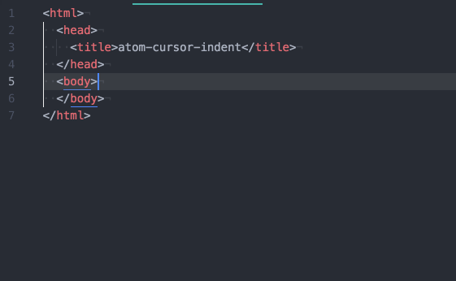

# atom-cursor-indent package

Makes the cursor follow the desired (auto) indentation on empty lines.

Inspired by the [virtual space snippet](https://discuss.atom.io/t/virtual-space/15603/3) by [Olmo Kramer](https://discuss.atom.io/users/olmokramer).
